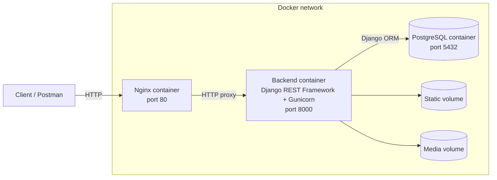

# Deployment Diagram

```mermaid
flowchart LR
    Client[Client / Postman]

    subgraph DockerNetwork[Docker network]
        Nginx[Nginx container\nport 80]
        Backend[Backend container\nDjango REST Framework + Gunicorn\nport 8000]
        DB[(PostgreSQL container\nport 5432)]
        Static[(Static volume)]
        Media[(Media volume)]
    end

    Client -->|HTTP| Nginx
    Nginx -->|HTTP proxy| Backend
    Backend -->|Django ORM| DB
    Backend --> Static
    Backend --> Media
```
