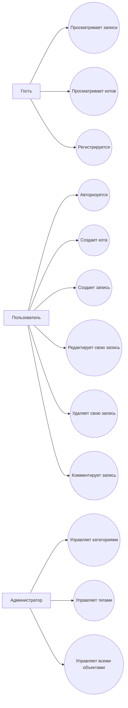

# Use Case Diagram

```mermaid
flowchart LR
    Guest[Гость]
    User[Пользователь]
    Admin[Администратор]

    UC1((Просматривает записи))
    UC2((Просматривает котов))
    UC3((Регистрируется))
    UC4((Авторизуется))
    UC5((Создает кота))
    UC6((Создает запись))
    UC7((Редактирует свою запись))
    UC8((Удаляет свою запись))
    UC9((Комментирует запись))
    UC10((Управляет категориями))
    UC11((Управляет тегами))
    UC12((Управляет всеми объектами))

    Guest --> UC1
    Guest --> UC2
    Guest --> UC3
    User --> UC4
    User --> UC5
    User --> UC6
    User --> UC7
    User --> UC8
    User --> UC9
    Admin --> UC10
    Admin --> UC11
    Admin --> UC12
```
